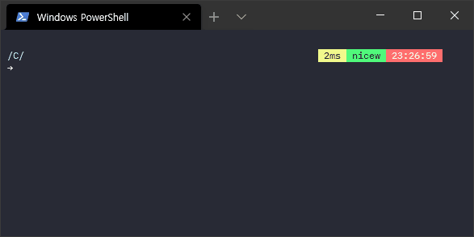
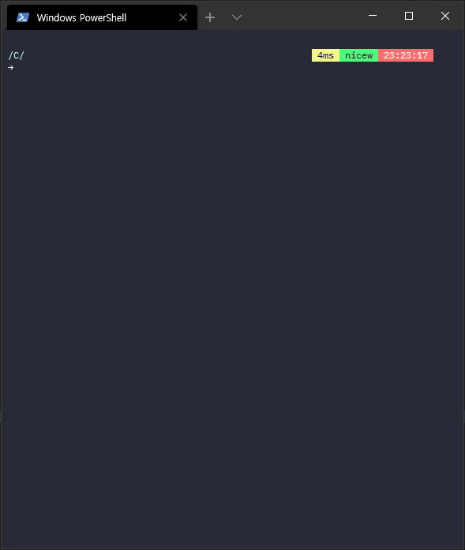
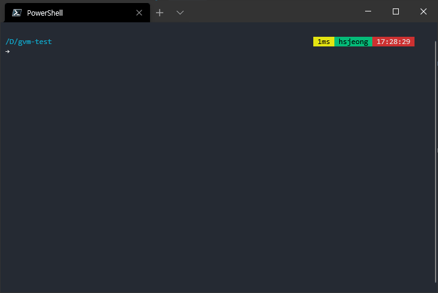
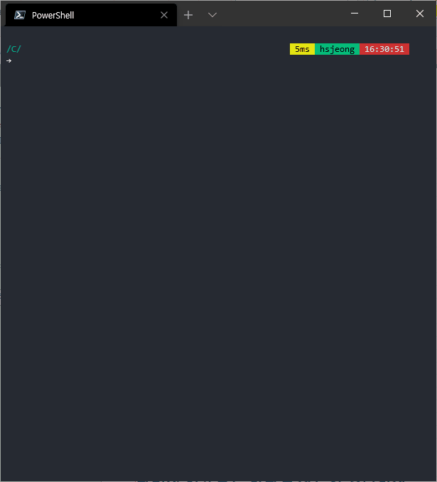

# GVM - Go Version Manager for Windows

[](https://goreportcard.com/report/github.com/David-Coach-Dev/gvm)
[](https://github.com/David-Coach-Dev/gvm/releases)

GVM is a Go version manager for Windows, inspired by [NVM for Node.js](https://github.com/nvm-sh/nvm) and [NVM-Windows](https://github.com/coreybutler/nvm-windows). It allows you to install and switch between multiple versions of Go with ease on Windows systems.

> **Note:** For Linux/macOS, use the original [GVM](https://github.com/moovweb/gvm)

## 🚀 Installation

### One-line Installation (recommended)

**PowerShell (Windows):**
```powershell
iwr -useb https://raw.githubusercontent.com/David-Coach-Dev/gvm/main/install-nvm-style.ps1 | iex
```

**Command Prompt (Windows):**
```cmd
curl -o install-gvm.bat https://raw.githubusercontent.com/David-Coach-Dev/gvm/main/install-gvm.bat && install-gvm.bat
```

### Manual Installation

1. Download the latest release from [GitHub Releases](https://github.com/David-Coach-Dev/gvm/releases)
2. Extract and add to your PATH
3. Set `GVM_HOME` environment variable

## 📖 Usage

### Install and use Go versions

```bash
# Install the latest Go version
gvm install latest

# Install a specific Go version
gvm install 1.21.0
gvm install 1.20.5

# Use a specific Go version
gvm use 1.21.0

# List installed versions
gvm list

# List all available versions
gvm listall

# Uninstall a version
gvm uninstall 1.20.5
```

### Auto-switching with .go-version

Create a `.go-version` file in your project root:
```
1.21.0
```

GVM can automatically switch to this version when you enter the directory (if configured during installation).

## 🎯 Features

- **Windows Only**: Optimized specifically for Windows (like NVM-Windows for Node.js)
- **Zero Dependencies**: No need to have Go pre-installed
- **NVM-inspired**: Familiar commands and workflow
- **Auto-switching**: Optional automatic version switching per project
- **Shell Integration**: Works with PowerShell and Command Prompt
- **Safe Installation**: Installs in user directory, no admin privileges required

## 📂 Directory Structure

GVM installs Go versions in:
- **Windows**: `%LOCALAPPDATA%\gvm\versions\`


| Command | Description |
|---------|-------------|
| `gvm install <version>` | Install a specific Go version |
| `gvm use <version>` | Switch to a specific Go version |
| `gvm list` | List installed Go versions |
| `gvm listall` | List all available Go versions |
| `gvm uninstall <version>` | Remove a Go version |
| `gvm version` | Show GVM version |

### Examples

```bash
# Install Go 1.21.0
gvm install 1.21.0

# Switch to Go 1.21.0
gvm use 1.21.0

# List installed versions
gvm list

# List all available versions
gvm listall

# Remove Go 1.20.5
gvm uninstall 1.20.5
```

## 🛠️ Development

### Building from source

```bash
git clone https://github.com/David-Coach-Dev/gvm.git
cd gvm
go build -o gvm.exe main.go
```

### Contributing

1. Fork the repository
2. Create your feature branch (`git checkout -b feature/AmazingFeature`)
3. Commit your changes (`git commit -m 'Add some AmazingFeature'`)
4. Push to the branch (`git push origin feature/AmazingFeature`)
5. Open a Pull Request

## 📄 License

This project is licensed under the MIT License - see the [LICENSE](LICENSE) file for details.

## 🙏 Acknowledgments

- Inspired by [NVM](https://github.com/nvm-sh/nvm) for Node.js
- Original GVM for Unix by [moovweb](https://github.com/moovweb/gvm)

## 📞 Support

If you have any questions or run into issues, please open an issue on [GitHub](https://github.com/David-Coach-Dev/gvm/issues).

---

Made with ❤️ for the Go community

```
$ gvm list 
```


### listall

`listall` command shows the installed go SDK(s), and `system` means originally installed go.
```
$ gvm listall 
```


### install

`install` command installs go SDK(s)
- It checks if the version(s) already installed, or not existing version to install.
- It can install multiple versions at once.

```
$ gvm install 1.14.1 1.14.2
```



### uninstall

`uninstall` command uninstalls go SDK(s).
- It checks if the version(s) is/are not existing.
- It can uninstall multiple versions at once.

```
$ gvm uninstall 1.13.1 1.13.2
```


### use

`use` command changes using go SDK versions to desired.
- If no version specified, it shows the current using version of the go SDK
- If checks if the version is not installed.
- If you name the version as `system`, it will changes to the originally installed go version.


```
$ gvm use

$ gvm use system

$ gvm use 1.15.6
```



## Contact

If you want to contact me you can reach me at <nicewook@hotmail.com>

## License

<!--- If you're not sure which open license to use see https://choosealicense.com/--->

This project uses the following license: [<license_name>](link).

## Reference

- README.md template: https://github.com/scottydocs/README-template.md
- moovweb/gvm: https://github.com/moovweb/gvm
- Download go verions(Bill Kennedy): https://www.ardanlabs.com/blog/2020/04/modules-06-vendoring.html
```
